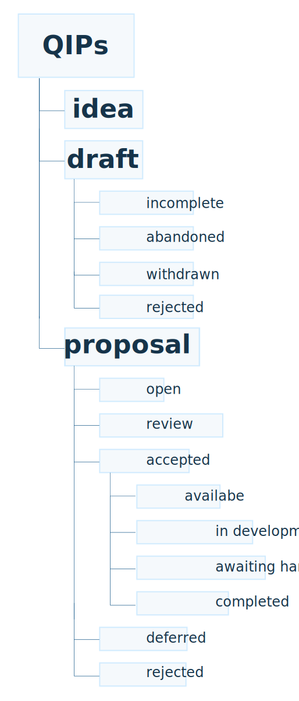

# QRL improvement proposals (QIPs)

Start with the [0. Process](./0.Process) folder

This repo is structured as per this diagram:

| QIP            | Type | Status      | Comments  |
| -------------|:-------------:|:-------------:|:-----:|
| [QIP001: Migration to Cryptonote v8][1] | Proposal | Open | [QIP001 comments][2] |
| [QIP002: MessageTransaction Encoded Message Standard][3] | Proposal | Open | [QIP002 comments][4] |
| [QIP003: Extended address functionality from master XMSS wallet][5] | Proposal | Open Draft | [QIP003 comments][6] |
| [QIP004: Multi-Signature Wallet][7] | Proposal | Open | [QIP004 comments][8] |
| [QIP005: Extending message transaction functionality ][9] | Proposal | Open Draft | [QIP005 comments][10] |
| [QIP006: Implement dPoW ][11] | Idea | Draft | [QIP006 comments][12] |
| [QIP007: Support Tokenization of Securities ][13] | Proposal | Open | [QIP007 comments][14] |
| [QIP008: Ephemeral message format proposal ][15] | Proposal | Open Draft | [QIP008 comments][16] |
| [QIP009: Change mining algorithm to RandomX ][17] | Proposal | Open Draft | [QIP009 comments][18] |
| [QIP010: Quanta emission change to 2 Quanta per minute ][19] | Proposal | Open Draft | [QIP010 comments][20] |

[1]:https://github.com/theQRL/qips/tree/master/2.Proposals/1.%20Open/1%20Cryptonote%20v8
[2]:https://github.com/theQRL/qips/pull/2
[3]:https://github.com/theQRL/qips/tree/master/2.Proposals/1.%20Open/2%20-%20MessageTransaction%20Encoded%20Message%20Standard
[4]:https://github.com/theQRL/qips/pull/4
[5]:https://github.com/theQRL/qips/blob/master/2.Proposals/1.%20Open/qip3.md
[6]:https://github.com/theQRL/qips/pull/5
[7]:https://github.com/theQRL/qips/blob/master/2.Proposals/1.%20Open/4%20Multi-signature%20wallet.md
[8]:https://github.com/theQRL/qips/pull/7
[9]:https://github.com/theQRL/qips/blob/master/2.Proposals/1.%20Open/5%20extended%20message%20format.md
[10]:https://github.com/theQRL/qips/pull/8
[11]:https://github.com/theQRL/qips/blob/master/1.Ideas/qip-000/6%20Implement%20dPoW.md
[12]:https://github.com/theQRL/qips/pull/10
[13]:https://github.com/theQRL/qips/tree/master/2.Proposals/1.%20Open/7%20-%20Support%20Tokenization%20of%20Securities
[14]:https://github.com/theQRL/qips/pull/15
[15]:https://github.com/theQRL/qips/blob/master/2.Proposals/1.%20Open/8%20-%20Ephemeral%20Message%20Format%20Proposal/8%20-%20ephemeral%20message%20format%20proposal.md
[16]:https://github.com/theQRL/qips/pull/17
[17]:https://github.com/theQRL/qips/pull/20/files#diff-1feb8c14d98a34fd4d30a29336422fa5
[18]:https://github.com/theQRL/qips/pull/20
[19]:https://github.com/theQRL/qips/blob/eaad8c8533c2e3b2346417317c17268977e6db20/Change%20Quanta%20emission%20to%202/test
[20]:https://github.com/theQRL/qips/pull/21
info@theqrl.org
